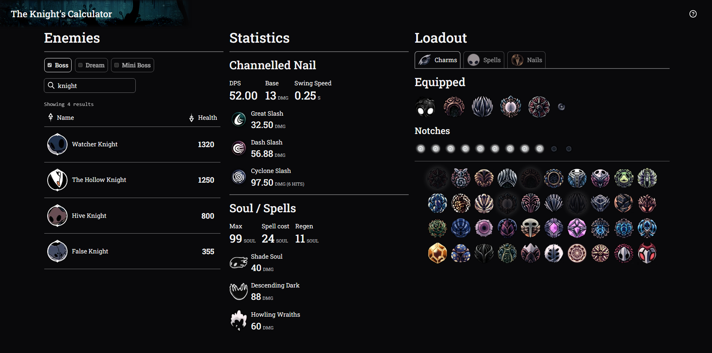
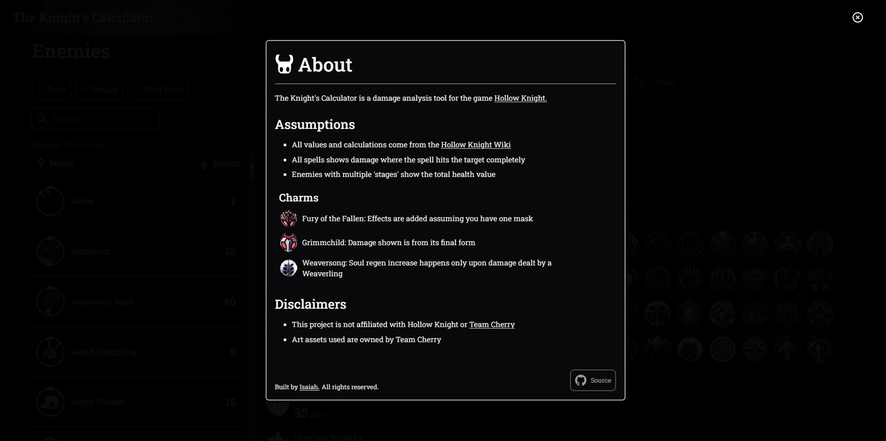
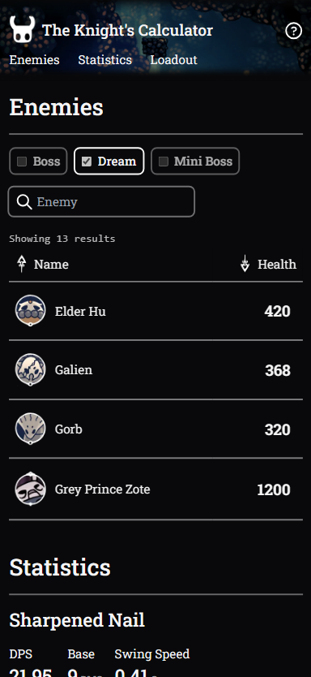
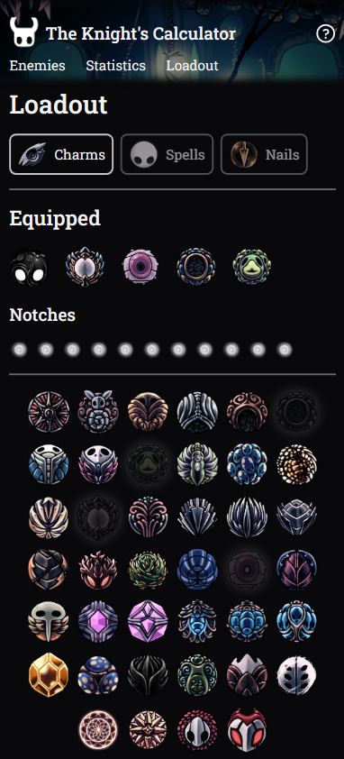

# The Knight's Calculator

[The Knight's Calculator](https://isaiahchin.github.io/the-knights-calculator/) is a web-based, damage analysis tool for the game [Hollow Knight](https://www.hollowknight.com/).
> ⚠️ **Note:** This webapp contains spoilers for Hollow Knight. All enemies, charms, nail upgrades and spell upgrades can be seen.

## Features

- **Statistics** - Explore The Knight's nail and spell damage + charm affects
- **Loadout** - Customise nail upgrades, spells and charms
- **Enemies** - Easily search for specific enemies to compare with

## Screenshots

### Desktop

### Mobile

## Disclaimer
This project is not affiliated with Hollow Knight or [Team Cherry](https://www.teamcherry.com.au/). All art assets used are owned by Team Cherry.

## License
This project it not offering a license. For more information [click here](https://choosealicense.com/no-permission/#for-users).
